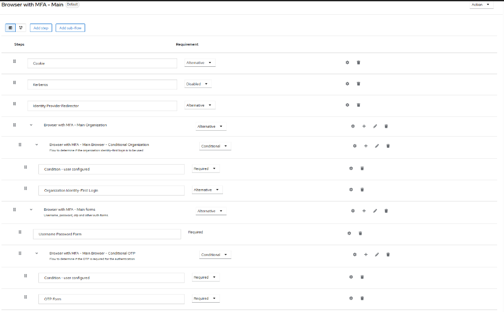

# 🦅 Keycloak Masterclass: The Complete Guide

*A step-by-step reference for configuring Keycloak, React, and Node.js.*

- [🦅 Keycloak Masterclass: The Complete Guide](#-keycloak-masterclass-the-complete-guide)
  - [🛠️ 0. Prerequisites \& Installation (Start Here)](#️-0-prerequisites--installation-start-here)
    - [A. Java Development Kit (JDK)](#a-java-development-kit-jdk)
    - [B. Download Keycloak](#b-download-keycloak)
    - [C. Start Keycloak (Dev Mode)](#c-start-keycloak-dev-mode)
  - [📦 1. Project Setup \& Dependencies](#-1-project-setup--dependencies)
    - [A. Frontend (React)](#a-frontend-react)
    - [B. Backend (Node.js/Express)](#b-backend-nodejsexpress)
  - [⚙️ 2. Keycloak Configuration (Step-by-Step)](#️-2-keycloak-configuration-step-by-step)
    - [Step 1: Create the Realm 🏰](#step-1-create-the-realm-)
    - [Step 2: Create Clients 💻](#step-2-create-clients-)
    - [Step 3: SMTP Email Configuration (Gmail) 📧](#step-3-smtp-email-configuration-gmail-)
  - [🚀 3. Advanced Features Dictionary](#-3-advanced-features-dictionary)
  - [🌎 5. OAuth: Social Login (GitHub)](#-5-oauth-social-login-github)
    - [Step 1: GitHub App](#step-1-github-app)
    - [Step 2: Keycloak Provider](#step-2-keycloak-provider)
    - [Step 3: Verify](#step-3-verify)
    - [Step 1: Backend Logic (The Toggle)](#step-1-backend-logic-the-toggle)
    - [Step 2: Authentication Flow (Conditional)](#step-2-authentication-flow-conditional)
      - [Troubleshooting: "Stuck in OTP Setup Loop"](#troubleshooting-stuck-in-otp-setup-loop)
  - [🛠️ 6. Developer Notes \& Findings (Troubleshooting)](#️-6-developer-notes--findings-troubleshooting)
    - [A. MFA "Infinite Loop" Fix](#a-mfa-infinite-loop-fix)
    - [B. "Admin Client" API Methods](#b-admin-client-api-methods)
    - [C. Clean MFA Disable](#c-clean-mfa-disable)
  - [📂 4. Appendix: Reference Code (The Solution)](#-4-appendix-reference-code-the-solution)
    - [A. Backend: `server.js` (Complete Logic)](#a-backend-serverjs-complete-logic)
    - [B. Frontend: `src/api.js` (Token Interceptor)](#b-frontend-srcapijs-token-interceptor)
    - [C. Frontend: `src/UserList.jsx` (Key Components)](#c-frontend-srcuserlistjsx-key-components)
    - [D. Theme: `email/html/executeActions.ftl` (Snippet)](#d-theme-emailhtmlexecuteactionsftl-snippet)

---

## 🛠️ 0. Prerequisites & Installation (Start Here)

### A. Java Development Kit (JDK)

Keycloak requires **Java 17** or higher.

1. **Check if you have it**: Open Terminal -> `java -version`.
2. **If incorrect/missing**: Download **OpenJDK 17** (e.g., from [Eclipse Temurin](https://adoptium.net/temurin/releases/)).
3. **Verify**: Ensure `JAVA_HOME` environment variable is set.

### B. Download Keycloak

1. Go to [keycloak.org/downloads](https://www.keycloak.org/downloads).
2. Download the **Server** distribution (ZIP format).
3. **Extract** it to a folder (e.g., `s:\Learn\KC\keycloak-26.0.0`).

### C. Start Keycloak (Dev Mode)

Dev mode is perfect for learning. It uses a lightweight local database and allows HTTP (no SSL required).

1. Open Terminal.
2. Navigate to the `bin` folder:

    ```bash
    cd s:\Learn\KC\keycloak-26.0.0\bin
    ```

3. Run the start script:
    - **Windows**: `kc.bat start-dev`
    - **Mac/Linux**: `./kc.sh start-dev`
4. Wait for the message: `Listening on: http://0.0.0.0:8080`.
5. Open your browser: [http://localhost:8080](http://localhost:8080).

---

## 📦 1. Project Setup & Dependencies

Before calculating roles or tokens, you need the right tools. Here is the exact "Tech Stack" we used.

### A. Frontend (React)

**Prerequisites**: Node.js (v18+), NPM.
**Initialization**: `npm create vite@latest web -- --template react`

**Required Packages**:

1. **`keycloak-js`**
    - *Command*: `npm install keycloak-js`
    - *Purpose*: The official adapter. It handles the redirects to Keycloak, parses the tokens, and manages the "Login/Logout" lifecycle.
2. **`keycloak-connect`** (Backend)
    - *Command*: `npm install keycloak-connect`
    - *Purpose*: Middleware to protect Express routes.

### B. Backend (Node.js/Express)

**Initialization**: `npm init -y`

**Required Packages**:
`express`, `keycloak-connect`, `express-session`, `@keycloak/keycloak-admin-client`, `cors`.

---

## ⚙️ 2. Keycloak Configuration (Step-by-Step)

### Step 1: Create the Realm 🏰

1. Login to Admin Console (`http://localhost:8080`).
2. Hover over top-left dropdown -> **Create Realm**.
3. **Realm name**: `learning-realm`.

### Step 2: Create Clients 💻

1. **Frontend (`learning-client`)**:
    - **Public** (Client Auth: OFF).
    - **Redirect URIs**: `http://localhost:5173/*`.
    - **Web Origins**: `http://localhost:5173`.
2. **Backend (`backend-client`)**:
    - **Confidential** (Client Auth: ON).
    - **Service Accounts Enabled**: ON.
    - **Permissions**: Assign `realm-admin` (or `manage-users` + `view-realm`) to the **Service Account Roles**.

### Step 3: SMTP Email Configuration (Gmail) 📧

*Essential for Invitations and Password Resets.*

1. Go to **Realm Settings** -> **Email**.
2. **Host**: `smtp.gmail.com` | **Port**: `587` | **Encryption**: `StartTLS`.
3. **Password**: Use an **App Password** (Not Google Password).

---

## 🚀 3. Advanced Features Dictionary

| Feature | Description | Implementation Key |
| :--- | :--- | :--- |
| **RBAC** | Role Based Access Control | `checkRoles(['admin'])` middleware in Express. |
| **Service Account** | Backend Login | `kcAdminClient.auth({ moduleId: 'backend-client' ... })`. |
| **Magic Link** | User Invitation | `adminClient.users.executeActionsEmail` with `UPDATE_PASSWORD`. |
| **Silent Refresh** | Token Security | `keycloak.updateToken(30)` in frontend API wrapper. |

| **Themes** | Custom Emails | `.ftl` templates in `themes/my-theme/email`. |

- [ ] Create `.ftl` templates in `themes/my-theme/email`.

| **Themes** | Custom Emails | `.ftl` templates in `themes/my-theme/email`. |

---

## 🌎 5. OAuth: Social Login (GitHub)

Enable "Login with GitHub" in 5 minutes.

### Step 1: GitHub App

1. Log in to GitHub -> Settings -> Developer settings -> **OAuth Apps**.
2. **New OAuth App**.
3. **Homepage URL**: `http://localhost:8080` (Keycloak).
4. **Authorization callback URL**: `http://localhost:8080/realms/learning-realm/broker/github/endpoint`.
5. **Save**.
6. Copy **Client ID** and generate a **Client Secret**.

### Step 2: Keycloak Provider

1. Keycloak Admin -> **Identity Providers**.
2. Select **GitHub**.
3. Paste **Client ID** and **Client Secret**.
4. **Save**.

### Step 3: Verify

1. Logout of your app.
2. Click "Sign In".
3. You should see the **GitHub** button on the login screen.

Keycloak supports Time-based One-Time Passwords (TOTP). We will make this **User-Controlled**.

### Step 1: Backend Logic (The Toggle)

1. **Enable**: We add the `CONFIGURE_TOTP` required action to the user. Keycloak will force them to setup OTP.
2. **Disable**: We find the user's `otp` credential and delete it.

### Step 2: Authentication Flow (Conditional)

> [!IMPORTANT]
> **CRITICAL SETTING**: You must ensure the OTP execution is **CONDITIONAL**, not Required.
> If it is set to **Required**, Keycloak will force *every* user to configure MFA, even if they disabled it in the app.

1. Go to **Authentication** -> **Browser** flow (or `Browser with MFA`).
2. Ensure **Browser - Conditional OTP** is set to **Conditional**.
    - *Logic*: If the user has an OTP configuration, ask for it. If not, skip it.



#### Troubleshooting: "Stuck in OTP Setup Loop"

If you disable MFA but Keycloak still asks for it:

1. Go to **Authentication**.
2. Click on your **Browser with MFA** flow.
3. Look at the line `OTP Form` or `Conditional OTP`.
4. **Change `Required` to `Conditional`**.
5. **Save**.

---

## 🛠️ 6. Developer Notes & Findings (Troubleshooting)

### A. MFA "Infinite Loop" Fix

If users are asked to setup MFA immediately after disabling it, the **Authentication Flow** is too strict.

- **Cause**: The OTP execution is set to `REQUIRED`.
- **Fix**: Set it to `CONDITIONAL`. This ensures Keycloak only challenges for MFA *if* the user has an OTP credential configured.

### B. "Admin Client" API Methods

When using `@keycloak/keycloak-admin-client` (v26+), some method names differ from older documentation:

- Use `adminClient.users.getCredentials(...)` instead of `listCredentials`.
- Use `adminClient.users.deleteCredential(...)` instead of `delCredential`.

### C. Clean MFA Disable

To fully disable MFA for a user, do not just remove the first credential found.

- **Scenario**: A user might have failed setups or multiple "zombie" credentials (e.g., from testing).
- **Solution**: Iterate through **ALL** credentials of type `otp` and delete them all. This ensures a "Hard Reset" of the MFA state.

---

## 📂 4. Appendix: Reference Code (The Solution)

### A. Backend: `server.js` (Complete Logic)

*Handles Auth, RBAC, User Creation, Invitations, and Password Resets.*

```javascript
const express = require('express');
const session = require('express-session');
const Keycloak = require('keycloak-connect');
const cors = require('cors');

const app = express();
const port = 3000;

app.use(cors());

// Configure Session
const memoryStore = new session.MemoryStore();
app.use(session({
  secret: 'some-secret',
  resave: false,
  saveUninitialized: true,
  store: memoryStore
}));

// Configure Keycloak Middleware
const keycloak = new Keycloak({ store: memoryStore }, {
  "realm": "learning-realm",
  "auth-server-url": "http://localhost:8080/",
  "ssl-required": "external",
  "resource": "learning-client",
  "bearer-only": true,
  "confidential-port": 0
});

app.use(keycloak.middleware());

// --- Helper: RBAC Middleware ---
const checkRoles = (allowedRoles) => (req, res, next) => {
  const token = req.kauth.grant.access_token;
  if (allowedRoles.some(role => token.hasRealmRole(role))) {
    next();
  } else {
    res.status(403).json({ error: "Access Denied" });
  }
}

// --- Helper: Admin Client (Service Account) ---
async function getAdminClient() {
  const { default: KeycloakAdminClient } = await import('@keycloak/keycloak-admin-client');
  const kcAdminClient = new KeycloakAdminClient({
    baseUrl: 'http://localhost:8080',
    realmName: 'learning-realm',
  });
  await kcAdminClient.auth({
    grantType: 'client_credentials',
    clientId: 'backend-client',
    clientSecret: 'YOUR_CLIENT_SECRET_HERE', // TODO: Replace this
  });
  return kcAdminClient;
}

// --- Routes ---

// 1. Create User (Invitation Logic)
app.post('/api/users', keycloak.protect(), checkRoles(['admin']), express.json(), async (req, res) => {
  try {
    const adminClient = await getAdminClient();
    const { username, email, firstName, lastName, phoneNumber, role, sendInvitation } = req.body;

    // Build Payload
    const userPayload = {
      username, email, firstName, lastName, enabled: true,
      emailVerified: false,
      attributes: { phoneNumber: [phoneNumber] }
    };

    // Legacy Mode: Set "password" if not inviting
    if (!sendInvitation) {
      userPayload.credentials = [{ type: 'password', value: 'password', temporary: true }];
      userPayload.emailVerified = true;
    }

    const newUser = await adminClient.users.create(userPayload);

    // Assign Role
    if (role && role !== 'standard') {
      const roleObject = await adminClient.roles.findOneByName({ name: role });
      if (roleObject) {
        await adminClient.users.addRealmRoleMappings({
          id: newUser.id,
          roles: [{ id: roleObject.id, name: roleObject.name }]
        });
      }
    }

    // Send Magic Link
    if (sendInvitation) {
        try {
            await adminClient.users.executeActionsEmail({
                id: newUser.id,
                actions: ['UPDATE_PASSWORD', 'VERIFY_EMAIL']
            });
        } catch (e) {
            return res.status(201).json({ ...newUser, warning: "User created, but Email failed (Check SMTP)." });
        }
    }

    res.status(201).json(newUser);
  } catch (error) {
     if (error.response?.status === 409) return res.status(409).json({ error: "User already exists" });
     res.status(500).json({ error: "Failed to create user" });
  }
});

// 2. Self-Service Password Change
app.put('/api/update-password', keycloak.protect(), express.json(), async (req, res) => {
    // Logic: Verify 'currentPassword' via Token Exchange, then Set 'newPassword' via Admin Client
    // (See full code in project)
});

// 3. Admin Reset Password
app.put('/api/users/:id/reset-password', keycloak.protect(), checkRoles(['admin']), async (req, res) => {
    const adminClient = await getAdminClient();
    await adminClient.users.executeActionsEmail({
      id: req.params.id,
      actions: ['UPDATE_PASSWORD']
    });
    res.json({ message: "Reset email sent" });
});

app.listen(port, () => console.log(`Server running on ${port}`));
```

### B. Frontend: `src/api.js` (Token Interceptor)

*Ensures every request has a fresh token.*

```javascript
import keycloak from './keycloak';

export const authorizedFetch = async (url, options = {}) => {
    try {
        // Refresh token if it expires in < 30 seconds
        await keycloak.updateToken(30);
    } catch (error) {
        keycloak.login();
        return;
    }

    const headers = {
        ...options.headers,
        'Authorization': `Bearer ${keycloak.token}`,
        'Content-Type': 'application/json'
    };

    return fetch(url, { ...options, headers });
};
```

### C. Frontend: `src/UserList.jsx` (Key Components)

*Shows how to pass the `sendInvitation` flag.*

```javascript
// Inside create function
const response = await authorizedFetch('http://localhost:3000/api/users', {
    method: 'POST',
    body: JSON.stringify({
        ...newUser,
        sendInvitation: true // <--- The Magic Flag
    })
});
```

### D. Theme: `email/html/executeActions.ftl` (Snippet)

*The simplified HTML template for invitations.*

```html
<html>
<body>
    <h2>Welcome to Our App!</h2>
    <p>Hello ${user.firstName!user.username},</p>
    <p>Click below to set your password:</p>
    <a href="${link}">Set My Password</a>
    <p>Expires in ${linkExpiration}</p>
</body>
</html>
```
